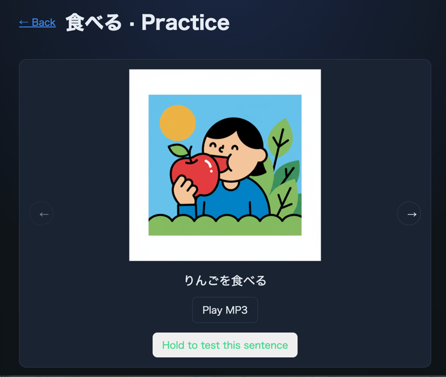
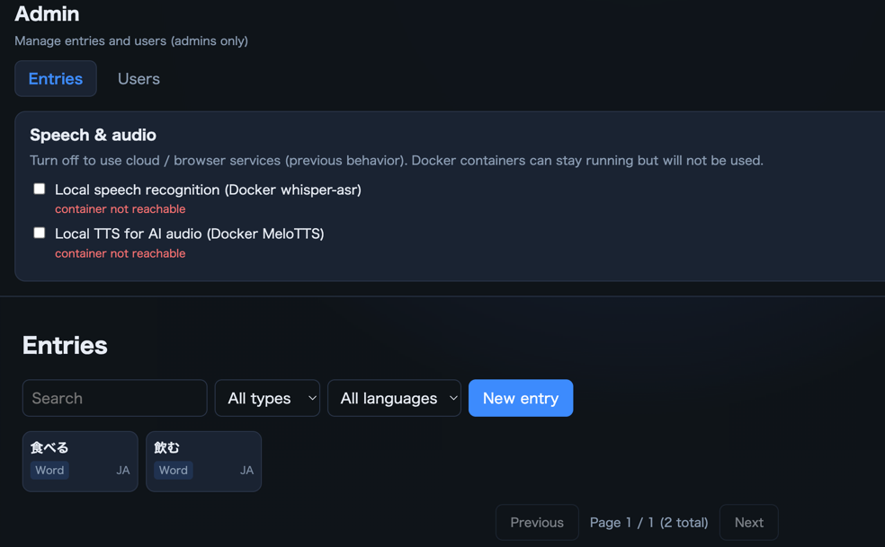
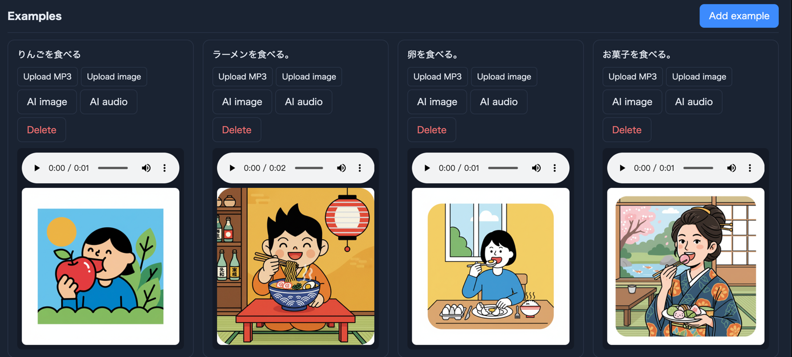

# Japanese Speaking Drill / 日语口语训练 / 日本語スピーキングドリル

Vue 3 + FastAPI + PostgreSQL full-stack app for Japanese speaking practice, test scoring, and admin content management.

联系邮箱 / Contact / 連絡先: `natureofwind@gmail.com`

Language / 语言 / 言語: [中文](#中文说明) | [English](#english) | [日本語](#日本語)
> Note: GitHub README language links jump to sections (anchor navigation).

---

## 中文说明

### 项目简介

- 学习端：词条学习、例句练习、语音测试、排行榜。
- 管理端：词条/例句/用户管理，音频图片上传，AI 图片与 AI 语音生成。
- 后端保证：评分与排行榜更新只在服务端进行。

### 项目结构

```text
backend/     FastAPI API
frontend/    Vue 3 + Vite
storage/     媒体文件（gitignore）
legacy/      旧版静态 demo
images/      README 截图资源
```

### 快速启动

1) 启动数据库（按需启动）：

```bash
docker compose up -d postgres
```

2) 初始化环境变量：

```bash
cp .env.example .env
```

3) 启动后端：

```bash
cd backend
python3 -m venv .venv
source .venv/bin/activate
pip install -r requirements.txt
uvicorn app.main:app --reload --host 0.0.0.0 --port 8000
```

4) 启动前端：

```bash
cd frontend
npm install
npm run dev
```

访问 `http://localhost:5173`，默认管理员账号：`admin / changeme`（仅首次空库种子时生效）。

### 数据库说明（重要）

- 应用使用数据库：`speaking_drill`（不是 `postgres`）。
- 若用 DB 客户端查看，请确认连接到 `speaking_drill.public`。
- 后端启动时会执行 `create_all`，缺表会自动补建。

### 本地 TTS 服务/模型切换

- 当前本地 TTS 默认是 `melotts` 容器（`timhagel/melotts-api-server`）。
- 你可以在 `docker-compose.yml` 里切换：
  - `DEFAULT_LANGUAGE`（例如 `EN` / `JP`）
  - `DEFAULT_SPEAKER_ID`（对应语言的说话人）
  - `DEFAULT_SPEED`
- 启动命令：

```bash
docker compose up -d melotts
```

- 后端读取 `.env` 的 `TTS_ENABLED` 和 `TTS_SERVICE_URL`。当本地容器不可用时，代码会按顺序回退到 `Edge TTS -> gTTS`。

### 截图上传 GitHub 流程

将截图放到 `images/` 后执行：

```bash
git add images README.md
git commit -m "docs: add screenshots and update trilingual README"
git push origin master
```

截图预览：





---

## English

### Overview

- Learner app: entries, sentence drills, speaking tests, ranking board.
- Admin app: CRUD for entries/examples/users, media upload, AI image and voice generation.
- Scoring and ranking updates are enforced on the backend only.

### Quick Start

1) Start database (on-demand):

```bash
docker compose up -d postgres
```

2) Prepare env:

```bash
cp .env.example .env
```

3) Start backend:

```bash
cd backend
python3 -m venv .venv
source .venv/bin/activate
pip install -r requirements.txt
uvicorn app.main:app --reload --host 0.0.0.0 --port 8000
```

4) Start frontend:

```bash
cd frontend
npm install
npm run dev
```

Open `http://localhost:5173`.
Default admin is `admin / changeme` (seeded only when `users` table is empty).

### Database Notes

- App DB is `speaking_drill` (not `postgres`).
- In DB clients, inspect `speaking_drill.public`.
- Backend checks tables on startup and creates missing ones.

### Switching Local TTS Provider/Model

- The default local TTS is the `melotts` Docker service (`timhagel/melotts-api-server`).
- You can tune provider-side model behavior in `docker-compose.yml` via:
  - `DEFAULT_LANGUAGE` (for example `EN` / `JP`)
  - `DEFAULT_SPEAKER_ID` (speaker profile for that language)
  - `DEFAULT_SPEED`
- Start local TTS:

```bash
docker compose up -d melotts
```

- Backend uses `.env` values `TTS_ENABLED` and `TTS_SERVICE_URL`. If local MeloTTS is unavailable, fallback order is `Edge TTS -> gTTS`.

### Screenshot Upload to GitHub

After putting screenshots in `images/`:

```bash
git add images README.md
git commit -m "docs: add screenshots and update trilingual README"
git push origin master
```

Screenshot preview:


---

## 日本語

### 概要

- 学習者画面：単語・例文練習、発話テスト、ランキング。
- 管理画面：単語/例文/ユーザー管理、メディアアップロード、AI 画像/音声生成。
- 採点とランキング更新はバックエンド側でのみ実行されます。

### 起動手順

1) DB を必要時に起動：

```bash
docker compose up -d postgres
```

2) 環境変数を準備：

```bash
cp .env.example .env
```

3) バックエンド起動：

```bash
cd backend
python3 -m venv .venv
source .venv/bin/activate
pip install -r requirements.txt
uvicorn app.main:app --reload --host 0.0.0.0 --port 8000
```

4) フロントエンド起動：

```bash
cd frontend
npm install
npm run dev
```

`http://localhost:5173` を開いてください。  
初期管理者は `admin / changeme`（`users` が空の初回のみ作成）。

### DB 注意点

- 使用DBは `speaking_drill`（`postgres` ではない）。
- DB クライアントでは `speaking_drill.public` を確認してください。
- バックエンド起動時に不足テーブルを自動作成します。

### ローカル TTS の切り替え

- 既定のローカル TTS は `melotts` コンテナ（`timhagel/melotts-api-server`）です。
- `docker-compose.yml` で以下を切り替えできます：
  - `DEFAULT_LANGUAGE`（例: `EN` / `JP`）
  - `DEFAULT_SPEAKER_ID`（言語ごとの話者）
  - `DEFAULT_SPEED`
- 起動コマンド：

```bash
docker compose up -d melotts
```

- バックエンドは `.env` の `TTS_ENABLED` と `TTS_SERVICE_URL` を参照します。MeloTTS が使えない場合は `Edge TTS -> gTTS` の順でフォールバックします。

### スクリーンショットを GitHub へ反映

`images/` に画像を置いた後：

```bash
git add images README.md
git commit -m "docs: add screenshots and update trilingual README"
git push origin master
```

スクリーンショット表示：


